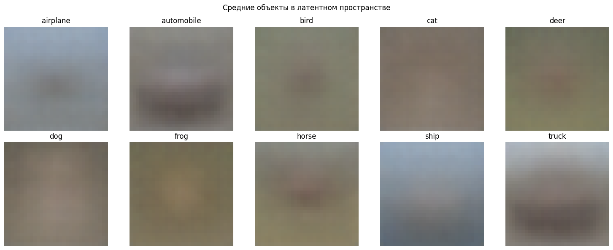
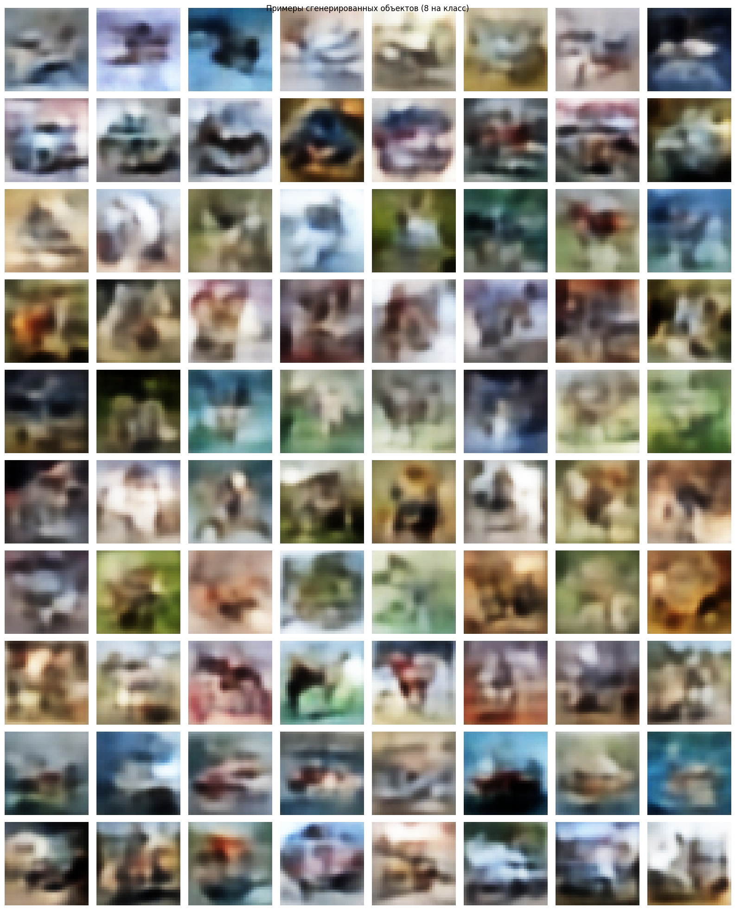

# vae-cifar10

Вариационный автоэнкодер на CIFAR-10 и проверка того, насколько сгенерированные им данные годятся для обучения классификатора.

[](https://colab.research.google.com/github/yoonzky/vae-cifar10/blob/main/vae_cifar10.ipynb)

## Задача

1. Обучить VAE на CIFAR-10 без готовых реализаций автоэнкодера.
2. Построить "средний" объект каждого класса в латентном пространстве.
3. Добавить к нему шум и сгенерировать по 5000 новых объектов на класс.
4. Обучить свёрточную сеть на этих объектах, проверить на настоящих и сравнить с обучением на реальных данных.

## Как устроено

- **Энкодер** — четыре свёртки со stride 2 (3 -> 32 -> 64 -> 128 -> 256), BatchNorm и LeakyReLU(0,2), затем два линейных слоя на `mu` и `log_var`. Декодер зеркальный. Поверх `mu` стоит линейный классификатор на 10 классов. Классы `Encoder`, `Decoder`, `CNN` написаны вручную.
- **Loss:** MSE реконструкции и KL суммируются по картинке и усредняются по батчу, к ним добавляется кросс-энтропия классификатора с весом `GAMMA`.
- **Параметры:** латентное пространство 128, 60 эпох, learning rate 1e-3, batch 128, beta = 0,1, gamma = 100.
- **Генерация:** для каждого класса считаются среднее и ковариация латентных векторов его объектов. Новый объект получается как среднее плюс шум из нормального распределения с ковариацией этого класса.
- **Классификатор:** четыре блока Conv — BatchNorm — Conv — BatchNorm — MaxPool — Dropout, 25 эпох, batch 64. Каждая картинка приводится к нулевому среднему и единичному разбросу, при обучении случайно отражается и сдвигается до 4 пикселей.
- Сиды зафиксированы (`torch.manual_seed(37)`), устройство выбирается автоматически: CUDA, MPS или CPU.

## Результаты

Прогон в Colab на T4, 60 эпох VAE и по 25 эпох на каждую CNN:

| Обучающие данные | Точность на реальном тесте |
| --- | --- |
| Реальный CIFAR-10 | **84,13 %** |
| Сгенерированный VAE | **42,37 %** |

Точность на генерации заметно скачет от эпохи к эпохе, на последних десяти она от 42 до 46 %.

"Средние" объекты классов. У машины, грузовика, самолёта и корабля угадываются силуэт и фон, у животных осталось цветовое пятно.



Сгенерированные примеры, по восемь на класс. Форма и цвет читаются, машины, корабли и самолёты узнаются, с животными хуже:



## Запуск

```
pip install -r requirements.txt
jupyter notebook vae_cifar10.ipynb
```

Нужен GPU: в Colab это рантайм с T4, на Mac MPS. На M4 весь ноутбук считается около 33 минут.

## Стек

Python, PyTorch, NumPy, scikit-learn, Matplotlib; pyarrow и Pillow — для чтения датасета.

Учебный проект курса «Программные средства разработки систем искусственного интеллекта», СПбГЭТУ «ЛЭТИ», 2026.
